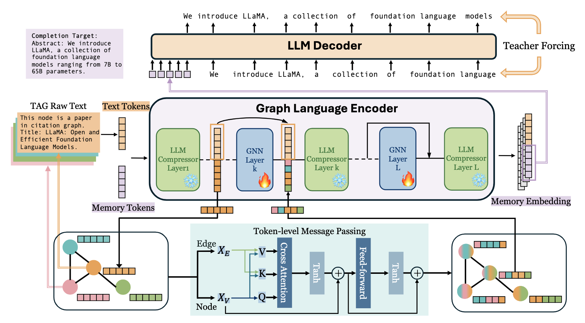
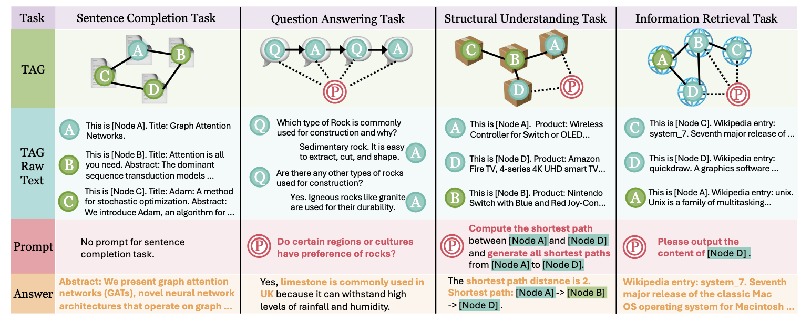
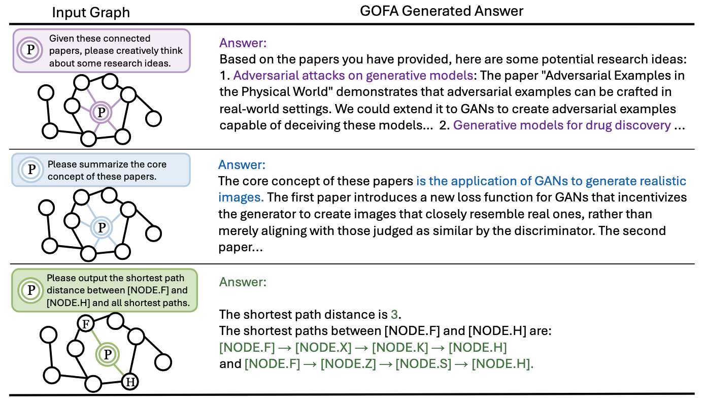

# Generative One-For-All (GOFA)
 The source code for ICLR 25 paper [GOFA: A  generative one-for-all model for joint graph language modeling](https://openreview.net/forum?id=mIjblC9hfm). [ArXiv](https://arxiv.org/abs/2407.09709)

## Installation Guide.
First, clone the code repository and move to the code file. Then, create the python environment. We provide environment configuration:
```
conda env create -f environment.yml
```

If you want to train the GOFA model from scratch, you will need [TAGLAS](https://github.com/JiaruiFeng/TAGLAS) dataset.

Clone the code of datasets under the root directory of GOFA:
```
git clone https://github.com/JiaruiFeng/TAGLAS.git
```

The project logs onto WandB, check this [site](https://docs.wandb.ai/quickstart/) for online logging. If you prefer local logging, simply set `offline_log` in `./configs/default_config.yaml` to True.

## Checkpoints
We provide both the pre-trained and instruction-tuned checkpoints in the [Huggingface repository](https://huggingface.co/WFRaain/GOFA/tree/main). Specifically:

`mistral_qamag03_best_ckpt.pth`: The pre-trained checkpoint.

`nb_instruct.pth`: The instruction fine-tuned checkpoint, which can be used to replicate the results of GOFA-T in the paper.

## Use GOFA

A minimalistic example to use GOFA is in ```chat_gofa.py```. You can modify the ```sample_graph.json``` file to specify your graph, GOFA works on any graph specified in the same format. If you plan to do graph completion, add the target node id to ```complete``` field, if you plan to do QA, add the target node id to ```question``` field.

The **pretrained checkpoints** and LoRA weights will be automatically loaded.

## Overview
`run_gofa.py` is the main entry point to train the GOFA model. The architecture of GOFA is depicted below.



`./configs` includes configuration for different settings. `default_config.yaml` is the base configuration, which can be overriden by specifying `--override {override_config dir}`.

For example, 
```
python run_gofa.py --override ./configs/pretrain_dev_config.yaml
```

You can also further specify the argument by a string input separated by spaces. For example,

```
python run_gofa.py --override ./configs/pretrain_dev_config.yaml l2 0.1 lr 0.00001
```

By default, GOFA use deepspeed ZeRO stage2 provided by pytorch-lightning for distributed training. This strategy is automatically enabled when the script detects more than 1 GPU.

The model implementation is in './modules/gofa/'.

## Pre-training
Pre-training requires large computational resources and time (4 days on 4 Nvidia A100 80GB). Refer to the example in ```chat_gofa.py``` on how to load our pretrained checkpoints.
To run the pretraining yourself, please first generate pretraining data using the following script. 

```
python pretrain_data_generation.py
```
The above code will generate three pretraining data subsets. The generation process requires a large memory and will last for a long time. Please allocate enough resources for generation.

The pretraining datasets all follow the graph completion paradigm as depicted below:



After data generation, run the following line to start the pretraining:
```
python run_gofa.py --override ./configs/pretrain_dev_config.yaml
```
Check `./configs/pretrain_dev_config.yaml` for hyperparameter settings and specify the correct pretraining dataset.

For example, after the first epoch, a deepspeed checkpoint will be automatically saved to `{ckpt_save_path}/{experiment start time}` specified in the config. If you want to train the second epoch on the second batch of data, change `last_epoch` to 1 and `ckpt_path` to the saved checkpoint, and run the same command.

Besides the deepspeed checkpoints, a copy of trainable parameters will be saved under `{root_path}/saved_exp/{experiment start time}` with the name `last_epoch_ckpt.pth`. **You can load this checkpoint for downstream fine-tuning. We also shared pretrained checkpoints in this format.**

## Instruction fine-tuning for zero-shot experiment.
To repeat the experiments of GOFA on zero-shot learning, run:
```
python run_gofa.py --override ./configs/instruct_dev_config.yaml load_dir {path/to/ckpt/}
```
Please change the `load_dir` to either the corresponding downloaded checkpoints or your own pretrained checkpoints.

Similarly, the script will save a checkpoint under `{root_path}/saved_exp/{experiment start time}`.

To specify the data used for training and evaluation, you will modify the `train_task_name` and `eval_task_name`. You can find examples in `./configs/inference_config.yaml`.

The list of available datasets is in `./TAGLAS/interfaces.py`.

## Evaluation and inference
To explore the generation result of GOFA, you can also directly run the inference mode with: 
```
python run_gofa.py --override ./configs/inference_config.yaml load_dir {/path/to/ckpt}
```
Please modify the config file to select the corresponding dataset. Note that for both the zero-shot and supervised experiments, the
trained model should be evaluated under inference mode to obtain the correct evaluation result. To replicate the results of GOFA-T in the paper, please download and set the load_dir to our uploaded [checkpoint](https://huggingface.co/WFRaain/GOFA/blob/main/nb_instruct.pth) `nb_instruct.pth` (See Checkpoint section).

GOFA generates interesting behavior on questions it has never seen, as shown below:



## Citation
```
@article{kong2024gofa,
  title={GOFA: A Generative One-For-All Model for Joint Graph Language Modeling},
  author={Kong, Lecheng and Feng, Jiarui and Liu, Hao and Huang, Chengsong and Huang, Jiaxin and Chen, Yixin and Zhang, Muhan},
  journal={arXiv preprint arXiv:2407.09709},
  year={2024}
}
```

